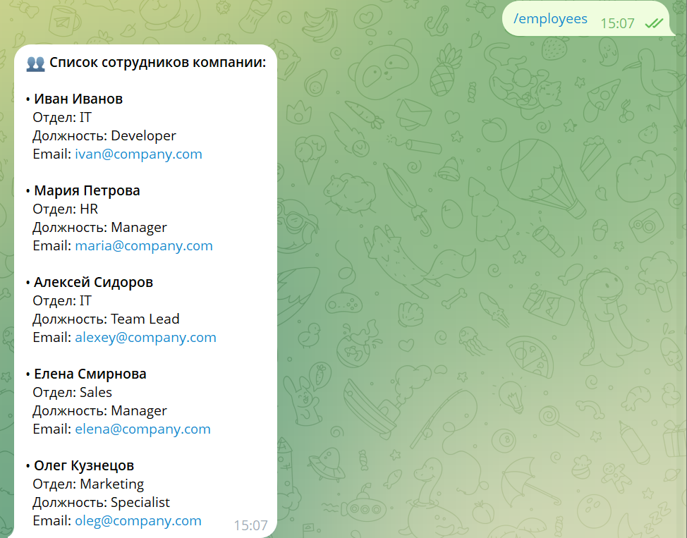
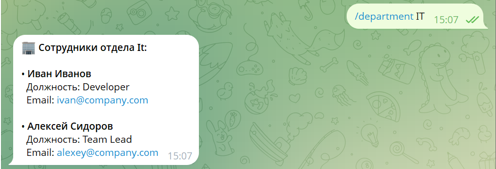

University: [ITMO University](https://itmo.ru/ru/)

Faculty: [FICT](https://fict.itmo.ru)

Course: [Vibe Coding: AI-боты для бизнеса](https://github.com/itmo-ict-faculty/vibe-coding-for-business)

Year: 2025/2026

Group: U4125

Author: Петров Михаил Юрьевич

Lab: Lab2

Date of create: 13.04.2026

Date of finished: 13.04.2026

# Лабораторная работа №2: Подключение бота к данным

## Описание интеграции
Выбран источник данных: **CSV-файл** со списком сотрудников компании.  
Почему CSV: не требует внешних API, легко редактируется, встроенная поддержка в Python (модуль csv), нет зависимости от интернета.

## Структура данных
Файл `employees.csv` содержит колонки:
- `name` – имя сотрудника
- `department` – отдел
- `role` – должность
- `email` – электронная почта

Пример строки: `Иван Иванов,IT,Developer,ivan@company.com`

## Промпт для LLM

У меня есть Telegram-бот на Python с библиотекой python-telegram-bot (версия 21.10). 
Бот уже умеет:
- /start, /help
- /add_contact (добавление контакта коллеги в JSON)
- /contacts (показать контакты)
- /remind (установить напоминание)
- /daily (дайджест)

Теперь нужно добавить работу с данными из CSV-файла (employees.csv). Файл содержит колонки: name, department, role, email.

Требуется добавить следующие команды:
1. /employees – показать всех сотрудников из CSV в виде красивой таблицы (можно просто текстом).
2. /search_employee <имя> – поиск сотрудника по имени (частичное совпадение, без учёта регистра). Выводить информацию: имя, отдел, должность, email.
3. /department <название отдела> – показать всех сотрудников из указанного отдела (например, /department IT).

Требования:
- Использовать встроенный модуль csv (не pandas, чтобы не усложнять).
- Обрабатывать ошибки: если файл не найден, если сотрудник не найден, если отдела нет.
- Код должен быть хорошо прокомментирован.
- Сохранить весь существующий функционал (контакты, напоминания и т.д.).
- Выдай полный код bot.py (с новыми командами) и обновлённый requirements.txt (если нужно добавить библиотеки).

## Реализация
- Использованы встроенные модули: `csv`, `os`, `asyncio`.
- Добавлены функции:
  - `load_employees()` – загрузка данных из CSV.
  - `search_employee_by_name()` – поиск по части имени.
  - `get_employees_by_department()` – фильтрация по отделу.
- Новые команды:
  - `/employees` – вывод всех сотрудников.
  - `/search_employee <имя>` – поиск.
  - `/department <отдел>` – сотрудники отдела.
- Обработка ошибок: если файл не найден или пуст – бот сообщает об этом.

## Тестирование
**Скриншоты работы команд:**

**Видео-демо:** [ссылка на видео](https://drive.google.com/file/d/1QNMs5Mhm7QLtqgVSAmI0QQeJEmBx_4w-/view?usp=sharing)

## Трудности и решения
| Проблема | Решение |
|----------|---------|
| В списке команд была опечатка `/searcheremployee` | Исправлено на `/search_employee` в коде бота |
| Бот не видел новые команды после обновления кода | Перезапущен бот (`Ctrl+C`, затем `py bot.py`) |

## Выводы
- Бот успешно интегрирован с CSV-данными.
- Все новые команды работают корректно, старый функционал сохранён.
- В будущем можно добавить кэширование данных или поддержку Excel.
