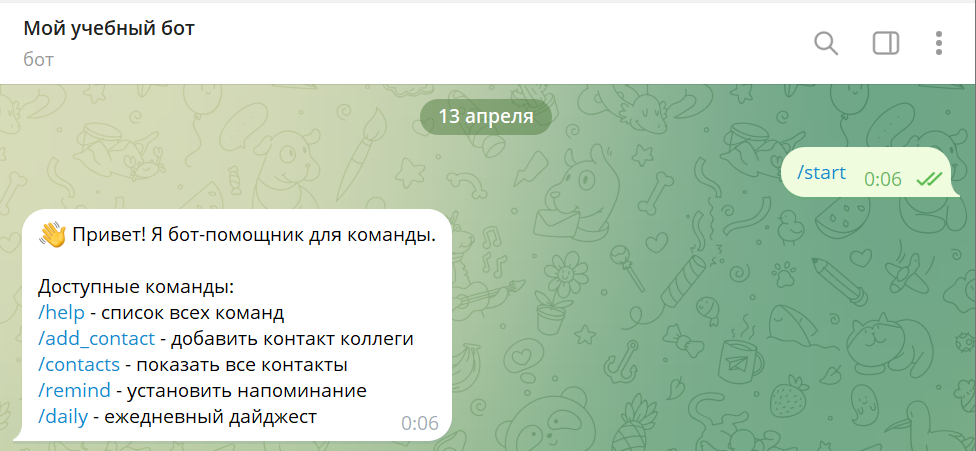
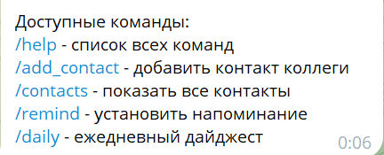
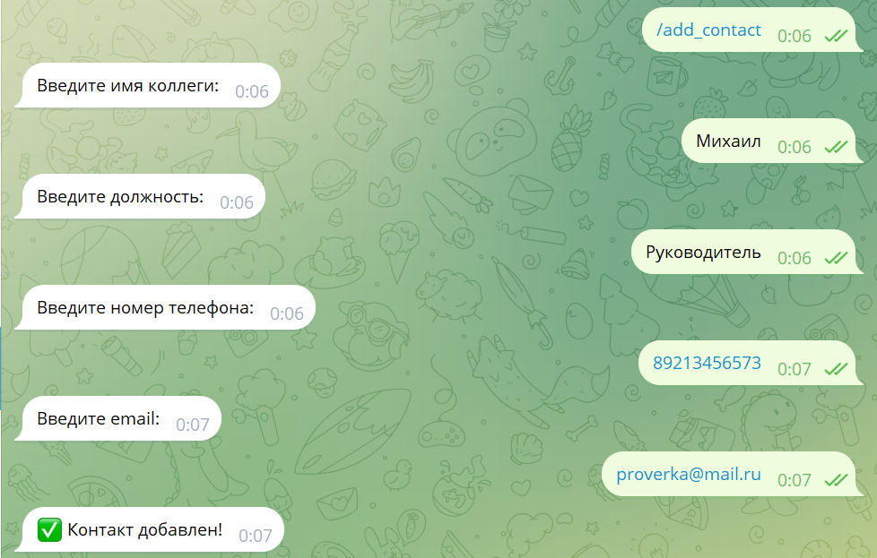
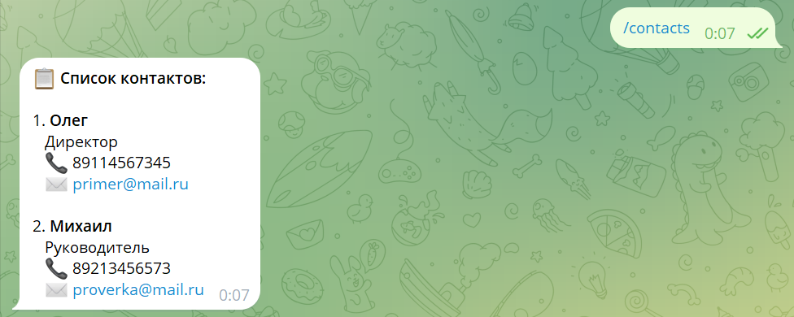
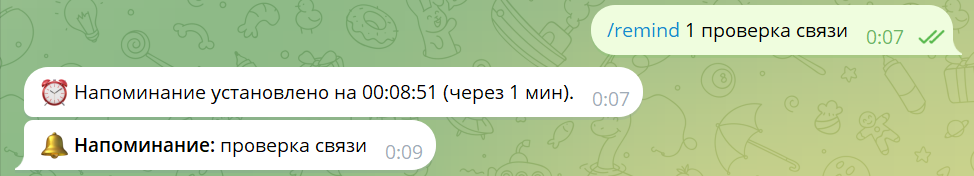

University: [ITMO University](https://itmo.ru/ru/)

Faculty: [FICT](https://fict.itmo.ru)

Course: [Vibe Coding: AI-боты для бизнеса](https://github.com/itmo-ict-faculty/vibe-coding-for-business)

Year: 2025/2026

Group: U4125

Author: Петров Михаил Юрьевич

Lab: Lab1

Date of create: 13.04.2026

Date of finished: 13.04.2026

# Лабораторная работа №1: Создание первого Telegram-бота без программирования

## Описание задачи
Выбран тип бота: **Бот-помощник для команды**.  
Бот позволяет:
- Хранить контакты коллег (имя, должность, телефон, email) в JSON-файле.
- Устанавливать напоминания с указанием времени в минутах.
- Отправлять ежедневный дайджест с количеством контактов и активными напоминаниями.

Почему выбрана эта задача: помогает централизованно хранить контакты и не забывать о важных делах.

## Промпт для LLM
**Исходный промпт:**
> Создай Telegram-бота на Python с использованием библиотеки python-telegram-bot (версия 20.x). Функционал: /start, /help, /add_contact (пошаговый ввод), /contacts (вывод списка), /remind <минуты> <текст>, /daily (дайджест). Хранение данных в JSON. Асинхронная фоновая проверка напоминаний. Обработка ошибок.

**Итерации улучшения:**
1. Ошибка `AttributeError: '_Updater__polling_cleanup_cb'` из-за конфликта версий с Python 3.14.
2. Обновил `python-telegram-bot` до версии 21.10, переустановил зависимости.
3. Исправил проблему с чтением `.env` (файл был `.env.txt`).

**Финальный промпт** — фактически использовался готовый код, сгенерированный AI с последующими правками.

## Стек технологий
- Python 3.14.3
- python-telegram-bot 21.10
- python-dotenv 1.0.0
- asyncio (встроенный)
- JSON для хранения данных

## Скриншоты и видео
**Скриншоты работы бота:**

**Видео-демо:** [Ссылка на видео](https://drive.google.com/file/d/1oOgQftQiUs0rKT1Jk52XknR3NJSIrkLk/view?usp=sharing)

## Трудности и решения
| Проблема | Решение |
|----------|---------|
| Файл `.env` сохранился как `.env.txt` → токен не читался | Переименовал в `.env` |
| Ошибка `AttributeError: '_Updater__polling_cleanup_cb'` | Обновил `python-telegram-bot` до версии 21.10 |
| Напоминания не срабатывали после перезапуска | Фоновая задача `check_reminders` работает в асинхронном цикле |

## Выводы
Что получилось хорошо: бот полностью работает, контакты сохраняются, напоминания приходят.  
Что можно улучшить: добавить кнопки, редактирование контактов, использовать SQLite.  
Чему научились: составлять промпты, отлаживать ошибки, работать с переменными окружения, использовать Git и GitHub.
