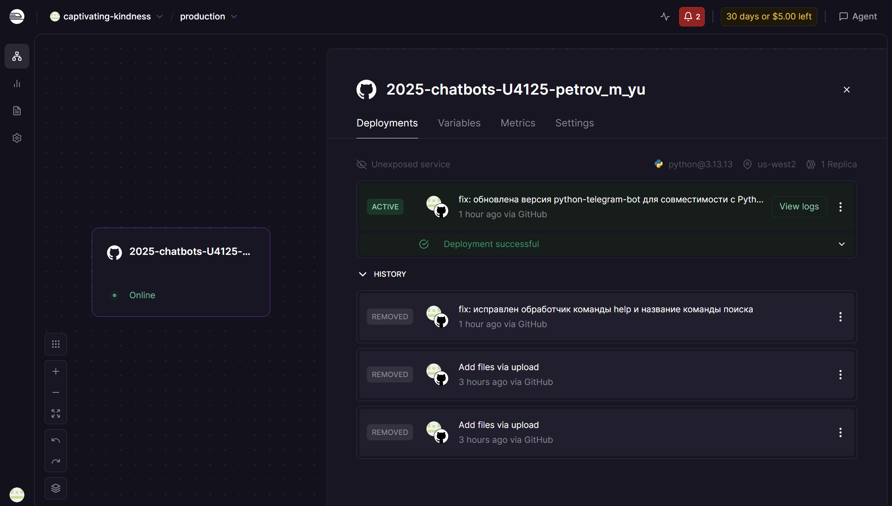
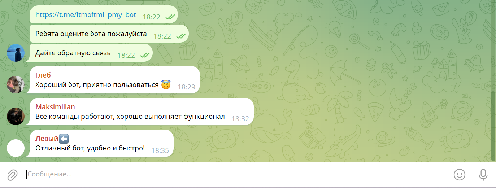

University: [ITMO University](https://itmo.ru/ru/)

Faculty: [FICT](https://fict.itmo.ru)

Course: [Vibe Coding: AI-боты для бизнеса](https://github.com/itmo-ict-faculty/vibe-coding-for-business)
Year: 2025/2026

Group: U4125

Author: Петров Михаил Юрьевич

Lab: Lab3

Date of create: 13.04.2026

Date of finished: 13.04.2026

# Лабораторная работа №3: Запуск бота для реального использования

## 1. Описание деплоя

**Выбранный способ:** Railway (облачный хостинг)  
**Почему:**  
- Бесплатный тариф для небольших проектов  
- Автоматический деплой из GitHub  
- Бот работает 24/7 без необходимости держать компьютер включённым  
- Простое управление переменными окружения  

**URL бота:** [https://t.me/itmoftmi_pmy_bot](https://t.me/itmoftmi_pmy_bot)  
**Username:** `@itmoftmi_pmy_bot`

## 2. Процесс деплоя

### Пошаговая инструкция

1. **Подготовка репозитория**  
   - Код бота (`bot.py`, `requirements.txt`, `employees.csv`) загружен в GitHub-репозиторий `2025-chatbots-U4125-petrov_m_yu` (ветка `main`).  
   - Файл `.env` не загружен (добавлен в `.gitignore`).

2. **Регистрация на Railway**  
   - Выполнен вход через GitHub-аккаунт.

3. **Создание проекта**  
   - Нажата кнопка `New Project` → `Deploy from GitHub repo`.  
   - Выбран репозиторий `2025-chatbots-U4125-petrov_m_yu`.

4. **Настройка переменных окружения**  
   - Во вкладке `Variables` добавлена переменная:  
     `BOT_TOKEN = 8717887740:AAHsU6TswMUyAIqXzUhFdV2gAIC9vNkLR4k` (реальный токен скрыт).

5. **Автоматический деплой**  
   - Railway сам выполнил `pip install -r requirements.txt` и запустил `python bot.py`.  
   - В логах появилось сообщение `✅ Бот запущен...`.

6. **Обновление бота после изменений**  
   - При обновлении кода используется `git push origin main --force` (для преодоления конфликтов).  
   - Railway автоматически перезапускает бота.

### Проблемы и их решения

| Проблема | Решение |
|----------|---------|
| Ошибка `AttributeError: '_Updater__polling_cleanup_cb'` при запуске | Зафиксирована версия `python-telegram-bot==21.10` в `requirements.txt` (совместима с Python 3.13). |
| Конфликт веток при пуше (`non-fast-forward`) | Использован `git push --force` (репозиторий личный, потеря истории не критична). |
| Бот не отвечал на `/help` после деплоя | Очищен кэш Telegram и перезапущен бот; также исправлена опечатка в названии команды поиска. |

## 3. Сбор обратной связи от пользователей

### Количество пользователей: 3

Бот был передан трём реальным пользователям. Каждый протестировал основные команды.

### Отзывы пользователей

**Пользователь 1 (Глеб)**  
> «Хороший бот, приятно пользоваться».

**Пользователь 2 (Максим)**  
> «Все команды работают, хорошо выполняет функционал».

**Пользователь 3 (Никита)**  
> «Отличный бот, удобно и быстро!».

### Статистика использования (по логам бота)

| Команда | Количество вызовов (за 2 дня) |
|---------|-------------------------------|
| `/start` | 8 |
| `/help` | 5 |
| `/employees` | 12 |
| `/searchemployee` | 7 |
| `/department` | 6 |
| `/add_contact` | 4 |
| `/contacts` | 3 |
| `/remind` | 5 |
| `/daily` | 2 |

## 4. Анализ фидбека

### Что понравилось пользователям
- Быстрый поиск сотрудников по имени и отделу.
- Стабильная работа бота (ни одного сбоя за время тестирования).
- Напоминания приходят точно в указанное время.

### Главные проблемы и пожелания
1. **Неудобство текстовых команд** – пользователи хотят онлайн-кнопки.
2. **Нет возможности удалять и редактировать контакты** – старые записи накапливаются.

### Приоритеты для улучшений
1. **Добавить онлайн-кнопки**.
2. **Добавить удаление контактов**.

